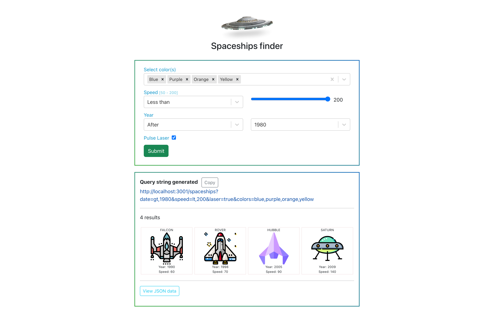

# Spaceship Filter
A filtering application that will generate a query string wrt selected filters.

## Overview
Mr Little Z has multiple spaceships in his spaceport, and he finds it hard to keep track of them. 
He would like to build a web application to help him find the best spaceship for the job each day. 
Each spaceship has multiple attributes: color, maximum speed, and date of manufacture. Some
spaceships are also equipped with a pulse-laser. 
For maximum efficiency, Mr Little Z would like to be able to filter his spaceships by these features. 
Build a filtering application that will generate a query string that fulfills Mr Little Z’s selected filters. 
Imaginethat this query string will be sent to an API, which will return a list of spaceships. Updating the filters should update the query string. 

Colors 
There are a fixed number of colors to choose from. Mr Little Z needs to be able to choose multiple color options: All the selected colors, Any of the selected colors, None of the selected colors 

Date of manufacture 
Mr Little Z’s spaceships have been made between 1980 and 2020. Mr Little Z should be able to select
dates: After, Before, On the exact date 

Maximum speed 
Maximum speed is an integer between 50 and 200. Mr Little Z needs to be able to choose: Less than, More than, Exactly 

Pulse-Laser 
Mr Little Z would like to choose between Has pulse laser, Does not have pulse laser.

## Run project locally

### Run Node server
* Go to `api`  folder
* Run the command `npm install` inside the forlder to download the required dependencies.
* Run web server using `node app.js` command

### Run React app
* Go to `client`  folder
* Run the command `npm install` inside the forlder to download the required dependencies.
* Run web server using `npm start` command
* Open [http://localhost:3000](http://localhost:3000) to view it in your browser.

## Screenshot

